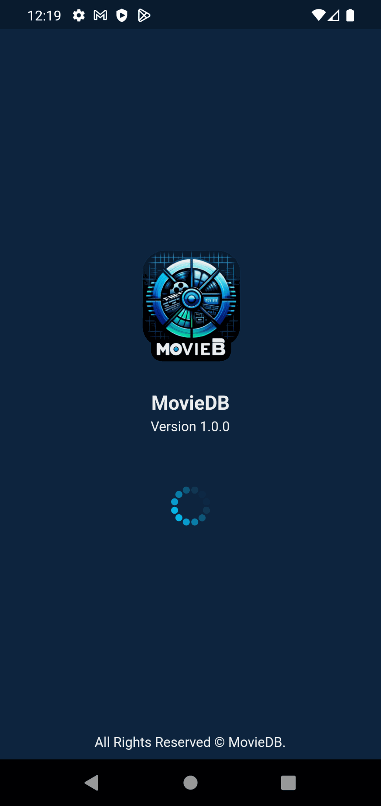

## Running the Application

To run the app, follow these steps:

1. Ensure you have Flutter installed and set up.
2. Clone the repository: `git clone https://github.com/laylashams5/moviedb`.
3. Navigate to the project directory: `cd mobile`.
4. Run `flutter pub get` to install dependencies.
5. Run `flutter run` to start the app on a connected device or emulator.

## Running the Web Application

To run the app, follow these steps:

1. git clone https://github.com/abidakram01/angular-movie-app.git
2. cd web
3. npm install
4. ng serve and go to http://localhost:4200/

Become a contributor ?
Find a bug, contribute some code or suggest ideas ? don't hesitate ! Create a pull request or an issue.
